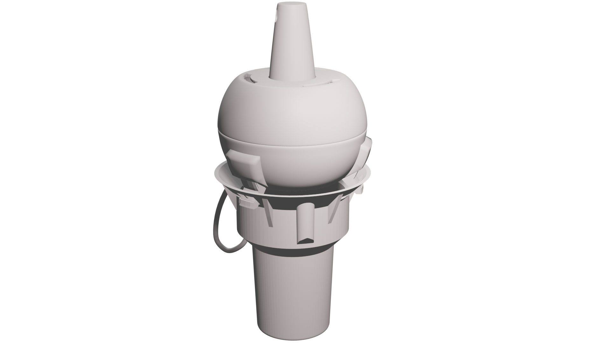
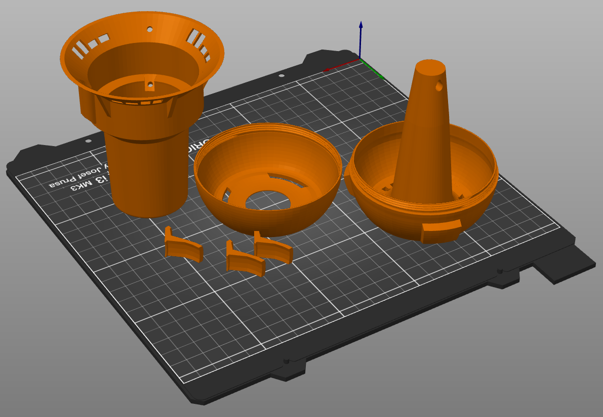
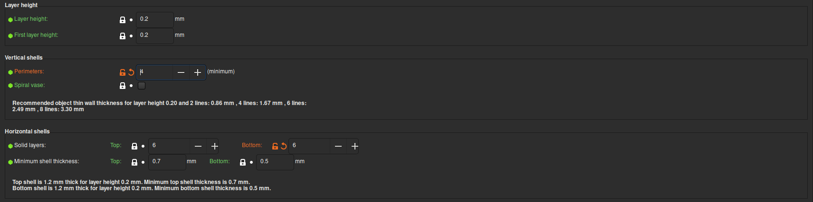
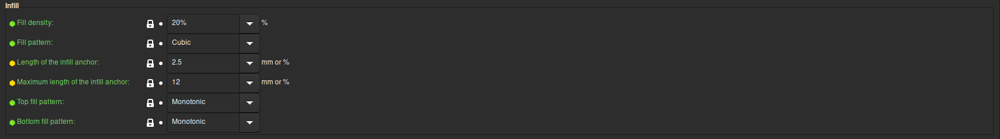

This collector helps to collect a sampler of the first liters of rain.

The collector automatically gathers the sample into the container and stops once the bottle is filled, preventing any dilution from subsequent runoff.

The sampler has been designed to be printed in the position showed in the previous picture, it does not need any support. To prevent the contamination of the water is recommended to use "PETG" and if possible use transparent filament to make sure it is as clean as possible.

Here the main parameters I used to print this sampler.

